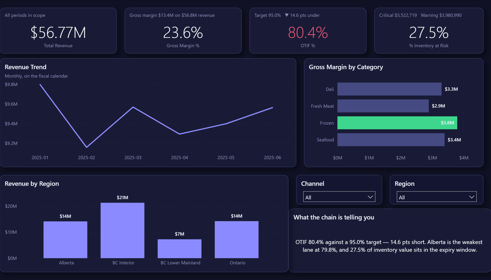
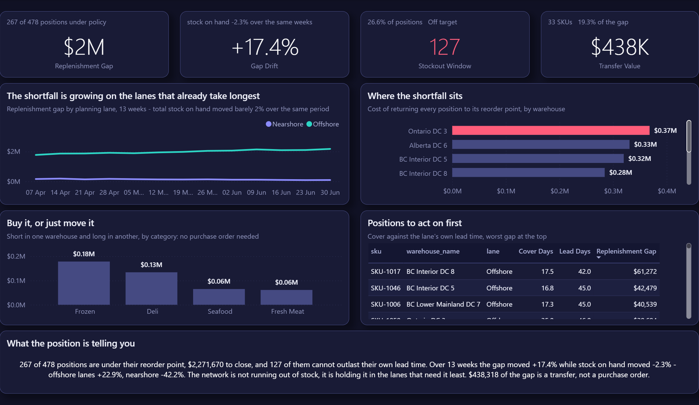
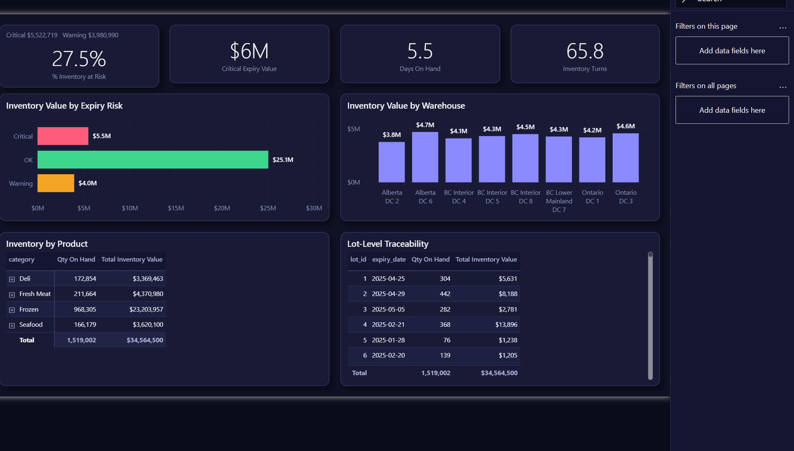
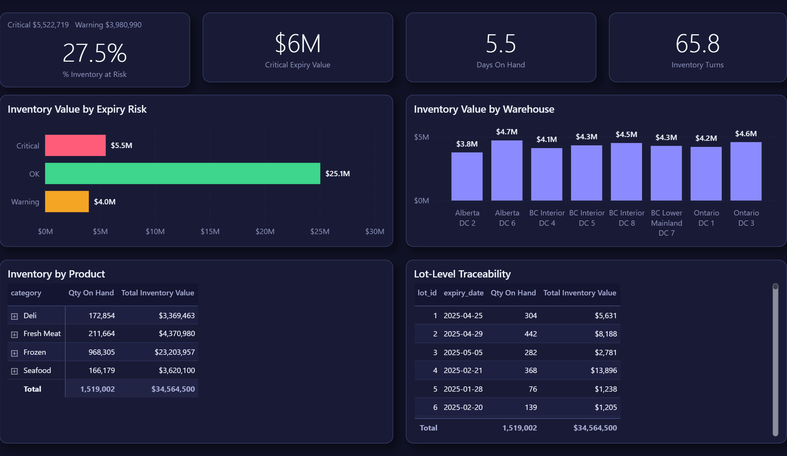
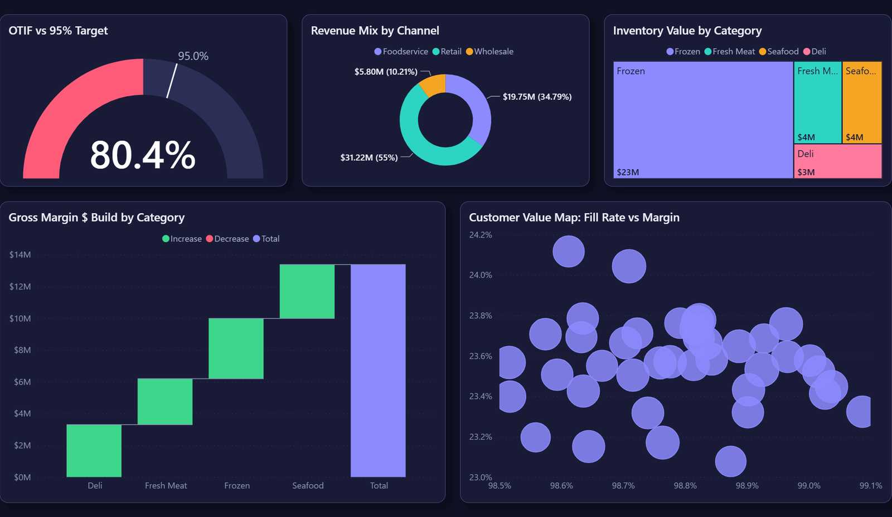
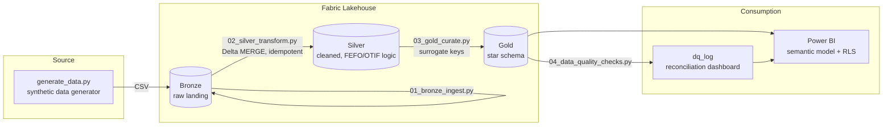

# Supply Chain Control Tower

[](https://github.com/KushPatel29/supply-chain-control-tower/actions/workflows/ci.yml)


In specialty food distribution, every pallet is a countdown timer. A case of
striploin with 90 days of shelf life is inventory; the same case with 3 days
left is a problem, and next week it's a write-off. I spent years building
analytics for exactly this business, and this repo is that work rebuilt in
the open — Microsoft Fabric medallion pipeline, star-schema semantic model,
a Power BI control tower with row-level security — on synthetic data,
because the original belongs to a former employer.

One rule governs everything here: **nothing is claimed that isn't run,
tested, or measured.** Every push regenerates the data from scratch, streams
a file drop through the exactly-once ingest, executes the whole pipeline
through a quarantine split and a data-quality gate that provably blocks bad
builds, exercises the model-promotion policy, and runs a 49-test suite. The
green badge above covers the failure paths too.

## The problem, in one walk through the warehouse

Picture the Monday questions at a perishables distributor. Ops wants to
know what expires this week and in which DC. Sales wants to know whether we
shipped Friday's orders complete and on time, because the OTIF penalty
clause in the grocery contract says 95% or we pay. Finance wants margin by
category and doesn't care about the first two questions until suddenly,
during an expiry write-off, they care very much.

A stock report answers none of this. "Units on hand" treats the 3-day
striploin and the 90-day striploin as the same number. So the pipeline here
treats urgency as data: every inventory row carries a `days_until_expiry`
and a FEFO risk band (**Critical ≤ 2 days, Warning ≤ 5**), computed once in
the Silver layer and inherited by everything downstream — no analyst
re-deriving expiry logic in a report ever again.

The KPI suite is the one both ops and finance sign off on:

| KPI | Definition | Where |
|---|---|---|
| OTIF % | Shipped on/before promised date AND fill rate ≥ 95% | `fact_orders` |
| Inventory Turns | Annualized COGS / average inventory value | `fact_inventory` |
| Days on Hand | 365 / Inventory Turns | `fact_inventory` |
| Expiry Risk | Critical (≤2 days), Warning (≤5 days), OK | `fact_inventory` |
| Gross Margin % | (Revenue − COGS) / Revenue | `fact_orders` |

Each definition lives in [`docs/metric_dictionary.md`](docs/metric_dictionary.md)
with its formula, grain, owner, and refresh SLA, and only changes via PR in
the same commit as the code — because the fastest way to lose an executive's
trust is two dashboards disagreeing on what "OTIF" means.

## The control tower itself

Six report pages, hand-authored as a Power BI Project (TMDL semantic model
+ PBIR definition) in [`powerbi/pbip/`](powerbi/pbip/) — open
`SupplyChainControlTower.pbip` in Desktop and hit Refresh.

Every KPI carries its target and the gap to it, the headline figure is
coloured by a `Status` measure rather than by eye, and each page states its own
conclusion in a sentence built from DAX — so the narrative cannot drift away
from the numbers under it.

**Executive Overview** — revenue, margin, OTIF and expiry risk on one screen:


**Global Sourcing Risk** — where the goods actually come from, and what
happens when a lane closes:



**Inventory & Network Health** — the planner's view: position against reorder
point, the shortfall split nearshore vs offshore across 13 weeks, and the part
of it a stock transfer covers without a purchase order:



**Inventory & Expiry Risk** — FEFO banding, value at risk by warehouse, and
lot-level traceability (the "which customers got batch X" question, answered
in seconds):



**Fulfillment (OTIF)** — the trend, the by-channel cut, and a customer
scorecard for the quarterly review:



**Executive Insights** — OTIF gauge against target, margin waterfall,
a customer value map, the inventory treemap:



And it's live — every slicer cross-filters every visual:


## The half a single-country dashboard cannot see

The order and inventory facts describe one country's distribution network.
They cannot answer the questions a multinational control tower exists to
answer: how concentrated is the supply base, which SKUs have nowhere else to
go, and how long a switch takes when a lane closes. So the model gained an
approved vendor list — 155 awards across 60 SKUs and 15 suppliers in 9
countries — and [`analytics/supply_risk.py`](analytics/supply_risk.py) reads
it.

That layer was added the way the platform says additions happen. The bronze
contract permits new columns and refuses new tables, and it behaved exactly so:
the four new `dim_supplier` columns were logged as additive, and the new
`fact_sourcing` table **halted the pipeline with exit 3** until it was given a
contract entry and a row in `config/pipeline_metadata.json`. Onboarding a
source table really is a JSON entry rather than a new notebook, and this is the
run that proves it. The sourcing layer also draws from its own generator, so
every existing fact is byte-identical and every number already published from
them still holds.

**What it found.**

| | |
|---|---|
| Single-source SKUs | **3 of 60**, carrying **6.3% of COGS** |
| Award concentration | median HHI **5,679** per SKU — most SKUs lean hard on one supplier |
| Origin concentration | HHI **1,620** across 9 countries |
| Largest origin | **Mexico, 27.2% of COGS** across 36 SKUs |
| If Mexico's lanes close | **13 SKUs** have no qualified alternate; the rest wait **31.7 days** |
| Offshore trade-off | 57.5% of COGS at **35.3 days** and price index 0.818, against **14.5 days** at 0.916 nearshore |

The disruption scenario counts a *qualified* alternate only. An unqualified
supplier needs a requalification programme before it can absorb volume, so
folding the two together would produce a comforting number that is wrong in
precisely the situation it exists for.

**And a finding about the service metric itself.** OTIF is an AND of two
independent failures, and reporting only the product hides which one to fix.
Split apart, on-time is **89.9%** and in-full is **89.3%** — but the failures
barely overlap: 1,781 orders were late only, **1,902 were short only**, and just
234 were both. Short-shipping, not lateness, is the bigger driver of an 80.4%
OTIF. That is a different corrective action, a different owner, and it is
invisible until you decompose it. It is asserted as a test, so if the data ever
makes lateness the bigger driver the claim fails instead of ageing into a lie.

**What it deliberately does not compute.** Landed cost and freight — there is no
freight, duty or FX data here, and a landed cost built on an invented freight
rate is a decoration. Cash-to-cash — inventory days exist, DPO and DSO do not,
and two thirds of a cycle is not a cycle.


## Plenty of stock, and still short

`fact_inventory_snapshot` models lots depleting. That is the right shape for
FEFO, expiry and "which customers got batch X", and the wrong shape for
planning — measured on it, every SKU looks permanently stocked out by the last
snapshot. A planner works from a stock *position*: on hand, on order, and the
target the policy says should be there. So the model gained one, weekly per
SKU x warehouse for a quarter, driven by the demand actually in `fact_orders`
so the analysis is not circular, and
[`analytics/inventory_health.py`](analytics/inventory_health.py) reads it.

The reorder point is cycle stock plus safety stock from King's formula, which
carries **both** sources of variability — demand varying over the lead time,
*and* the lead time itself varying against average demand. Dropping the second
term is the standard way a safety stock ends up too small on a long offshore
lane, which is exactly where it matters most. The test asserts the result
matches the full formula **and does not match** the demand-only one, because a
"greater than" assertion passes either way once you round to whole units.

**What it found.**

| | |
|---|---|
| Positions under policy | **267 of 478**, **$2,271,670** to close (**$1,684,061** on A-class) |
| Cover vs its own lead | **127 positions** cannot outlast their own replenishment lead |
| Idle working capital | **$545,732** sitting above 1.5x reorder point, on 47 positions |
| Coverable by transfer | **33 SKUs**, **$438,318** — **19%** of the gap needs no purchase order |
| Over 13 weeks | the gap grew **+17.4%** while stock on hand moved **−2.3%** |
| ...offshore lanes | gap **+22.9%**, stock **−4.2%** |
| ...nearshore lanes | gap **−42.2%**, stock **+23.2%** |

That last pair is the finding, and a national total would have buried it. The
network is not running out of stock; it is rotating stock out of the lanes that
need the cover and into the ones that don't. Nearshore lanes re-order inside a
single period and overshoot because they can; offshore lanes take longer to
respond than the demand signal driving them, so they bleed. Days of cover on
its own cannot see this either — 20 days is comfortable on a 6-day lane and a
guaranteed stockout on a 40-day one — so every position is compared to **its
own** lead time rather than to a network average.

The lane a SKU belongs to is the bloc of its **slowest approved source**, not
an average of its sources, because the slowest is the one the reorder point was
built from. It reuses the sourcing bloc from the section above, so the two
pages cannot disagree about what "offshore" means. A test asserts it on the
dual-sourced, mixed-bloc SKUs specifically, and fails if that ever stops being
true.

**Buy it, or just move it.** A shortage in Calgary against a surplus of the
same SKU in Halifax is not a buying problem, it is a moving problem — faster,
cheaper, and invisible whenever shortage is only ever reported nationally. The
two are separated rather than netted: shortfalls are summed, never cancelled
against surpluses, because a surplus of SKU A does not fill a hole in SKU B.

**What it deliberately does not compute.** XYZ demand classification — every
SKU here lands in the same variability band (CV 0.58–0.77), so the axis would
separate nothing. Carrying cost and stockout cost in dollars — no holding rate
or lost-margin assumption exists in this data, and inventing one turns a
measurement into an opinion.


## How the data flows

Classic medallion, for a practical reason: **Bronze keeps the receipts**
(raw landings, untouched, so you can always replay), **Silver is where the
business rules live** (dedup, referential checks, and the FEFO/OTIF/margin
logic — computed exactly once), and **Gold is the star schema** — the only
layer Power BI is ever allowed to touch.



The Silver loads use Delta `MERGE` keyed on natural keys, so re-running a
notebook never duplicates a row — boring by design, which is the highest
compliment you can pay a pipeline.

And table behavior is **data, not code**: merge keys, natural/surrogate
keys, partitioning, and Z-order columns live in
[`config/pipeline_metadata.json`](config/pipeline_metadata.json), read by
both the local orchestrator and the generic Fabric MERGE engine
([`notebooks/06_metadata_merge.py`](notebooks/06_metadata_merge.py)) that
loops the config and builds each `MERGE` dynamically. Seven tables makes
this tidy; five hundred makes it the difference between a platform and a
pile of notebooks. Onboarding a source table is a JSON entry plus a
contract — a test even verifies the configured merge keys are genuinely
unique in the data, because a MERGE on a non-unique key multiplies rows
silently.

Stack: Microsoft Fabric (Lakehouse, PySpark), Power BI (DAX, TMDL, RLS/OLS,
calculation groups), T-SQL for the Gold DDL, Python for everything that
proves the rest works.

## Orders don't wait for the nightly batch

A control tower that updates once a day is a rear-view mirror. So the
Bronze layer has a streaming front door:
[`pipeline/stream_ingest.py`](pipeline/stream_ingest.py) watches a landing
zone the way Spark's file source does — **incremental discovery** (only
files the checkpoint ledger has never seen) with **exactly-once** ingestion
that survives restarts. Drop a file, drain the stream, drain it again:
the second drain ingests nothing, and CI proves that on every push.
Malformed drops get ledgered as rejected with a reason and never block the
healthy ones.

The real-cluster version is
[`notebooks/05_stream_ingest.py`](notebooks/05_stream_ingest.py) — Spark
Structured Streaming with an explicit schema and `trigger(availableNow=True)`,
which runs on Fabric as-is (on Databricks the same pattern is
`cloudFiles`/Autoloader). Batch and stream converge on the same Silver
tables through the same idempotent `MERGE`.

## The pipeline that refuses to publish

Here's the incident this design exists to prevent: a source system hiccups,
a dimension picks up a duplicate key, every fact row joins twice, and
revenue silently doubles on the Monday executive dashboard. Nobody notices
until the CFO does. The fix isn't better dashboards — it's a pipeline that
**won't publish a broken build.**

[`pipeline/run_pipeline.py`](pipeline/run_pipeline.py) runs the same stage
graph as the Fabric spec, entirely locally: bronze → silver → gold → then
**20 data-quality checks** (completeness, key uniqueness, referential
integrity, a silver-to-gold control-total reconciliation), each tagged
critical or warning. One critical failure and the run halts, revokes the
publish marker so downstream never reads the bad build, and exits non-zero
— the exit code a Fabric If-Condition (or any scheduler) turns into a
blocked refresh and an alert.

The defense actually has three tiers, cheapest first. Tier one is the
**data contract** ([`contracts/bronze_v1.json`](contracts/bronze_v1.json)):
the version-controlled agreement about what source systems deliver, checked
**before a single row lands in Bronze**. New columns are additive and flow
through; a missing contracted column or a type drift (`integer` quietly
becoming `string` after an ERP upgrade) kills the run with exit code 3 and
a named violation — CI proves it by renaming a column and asserting the
lake stays untouched. The streaming front door enforces the same contract
per file.

Tier two is row-level. Halting is the right answer for structural corruption
— but halting the whole pipeline because one source row has a negative
quantity would trade a data problem for an SLA problem. So the Silver layer runs a **quarantine
split** first: every order row is validated against the business ruleset
(null keys, non-positive quantities, shipped-before-ordered, orphan foreign
keys), and toxic rows are routed to a quarantine table with
machine-readable `error_metadata` — `[{"field": "product_id", "issue":
"orphan_foreign_key"}]` — while the healthy 99.5% flows on and publishes.
A `--replay-quarantine` pass re-validates the parked rows once the source
fix lands and releases only the ones that now pass. And if toxins ever
exceed 2% of the stream, that's not a bad row, that's a broken source
system — the flood check escalates to critical and the gate takes over.

Every run also narrates itself for the 3 a.m. responder: structured JSONL
events — `run_id`, component, status, `duration_ms`, row counts — land in
an ops log (`<lake>/ops/pipeline_events.jsonl`; a Lakehouse table in
Fabric) that Datadog or Azure Monitor can tail as-is. Success, gate-block,
and contract-kill paths all leave the trail, and one `run_id` reconstructs
any run end-to-end. Tested, including the failure paths.

And because a gate you've never seen close is just decoration, CI sabotages
the build on every push — injects a duplicate key, and fails the workflow
unless the gate trips:

```bash
python pipeline/run_pipeline.py                     # bronze -> silver -> gold -> DQ -> publish
python pipeline/run_pipeline.py --simulate-schema-drift # contract kill: exit 3, lake untouched
python pipeline/run_pipeline.py --inject-dq-failure # watch it refuse: exit code 2, no publish
python pipeline/run_pipeline.py --inject-bad-rows 40 # quarantine demo: isolated, still publishes
python pipeline/run_pipeline.py --replay-quarantine  # release rows the source fix healed
pytest tests/ -v                                     # 182 tests: contracts, gate, quarantine, stream, promotion
```

## The forecast bake-off (in which the fancy model loses)

Demand planning needs a number for next month's order book, and everyone
has a favorite model. So instead of picking one, `analytics/demand_forecast.py`
makes four of them fight: rolling-origin backtesting, 4 folds, 28-day
horizon, scored on WAPE — the evaluation a demand planner would actually
accept, not one lucky train/test split.

| Model | Avg WAPE (lower is better) |
|---|---|
| **Moving average (28d)** | **18.5%** ← shipped |
| Gradient-boosted trees (lag + calendar features) | 19.6% |
| Holt-Winters (weekly seasonality) | 19.7% |
| Seasonal naive (the baseline to beat) | 24.3% |

I'll be honest: the boosted-tree challenger was supposed to win. It didn't.
On stable weekly demand, a 28-day moving average beats it, and the backtest
is what earns the right to ship the boring model. The test suite pins the
evaluation itself — no training leakage, full horizon coverage, and the
house rule: *beat the naive baseline or we ship the baseline.*


Every run logs params and metrics per model to **MLflow**
(`mlflow ui --backend-store-uri sqlite:///mlflow.db`), so the bake-off has
an auditable history instead of a folklore of "we tried that once."

And the decision doesn't stop at ship-day.
[`analytics/model_lifecycle.py`](analytics/model_lifecycle.py) watches the
champion's **operational WAPE** on the newest fold — the proxy for "last
cycle's forecast vs the actuals that just landed in Gold." Past 20% drift it
triggers a fresh bake-off, and a challenger takes the **`@champion` alias in
the MLflow Model Registry** only if it strictly beats the incumbent — ties
and losses change nothing, because a promotion policy with novelty bias is
just churn. The policy is a pure function with its own tests: hold, retrain-
and-hold, promote.

## Security that lives in a table, not in code

"Give the new BC manager dashboard access" should be a data edit, not a
model deployment. The semantic model ships three roles (all in TMDL, all in
git):

- **Regional Manager — dynamic RLS.** Entitlements sit in a hidden
  `security_mapping` table (UPN → region). The role filter —
  `dim_warehouse[region] IN CALCULATETABLE(VALUES(security_mapping[region]),
  security_mapping[upn] = USERPRINCIPALNAME())` — means a manager mapped to
  two regions sees both, and onboarding someone is one row. Verified live by
  DAX impersonation: the mapped principal sees exactly 4 of 8 DCs.
- **Field Ops — object-level security.** For this role `dim_supplier`
  doesn't filter to nothing; it *ceases to exist* (`metadataPermission:
  none` — queries can't even resolve the table name). Supplier commercial
  terms are on a need-to-know basis; the rest of the model works untouched.
- **Sales - BC Lower Mainland** — the static single-territory contrast case.

Time intelligence got the same "define it once" treatment: a
**calculation group** (Current / MTD / QTD / YTD / Previous Month / MoM % /
Rolling 28D) applies period logic to *every* measure — 7 calculation items
where the naive approach writes 19 measures × 7 variants and then maintains
133 of them forever.

While I was in the model with a profiler, I found something better than
what I was looking for: Power BI's auto date/time feature had quietly
attached a hidden calendar table to every date column, and those hidden
tables were **90.5% of the model's column storage**. The model already has
a proper `dim_date`. They're gone now — measurement, surgery, and the
before/after are written up in
[`docs/MODEL_OPTIMIZATION.md`](docs/MODEL_OPTIMIZATION.md).

## Does it scale? I stopped claiming and measured

The demo dataset is ~37k rows so the repo runs anywhere in seconds. The
design, though, is the 100M-row design — and [`benchmarks/`](benchmarks/BENCHMARKS.md)
puts numbers behind that instead of adjectives. A 10-million-row fact table
through Delta Lake, on a laptop:

- Incremental `MERGE` of a daily 50k-row delta: **0.5s**, vs 1.9s to reload
  the table — and the merge is idempotent and keeps history.
- `OPTIMIZE Z-ORDER BY (date_key, product_key)`: a one-day point query goes
  from touching **20 of 20 files to 1 of 20** — 95% file skipping, read
  straight from the transaction log's min/max stats, not inferred from
  timings.
- The honest caveat is in the write-up too: on local NVMe at 10M rows even
  a full rewrite is cheap. The *pattern* is what scales; the file-skipping
  ratio is the number that gets more valuable with size.

The write-up also does the FinOps math — with assumptions on the table
instead of hidden: at a plausible production scale (100M rows, 500
scan-bound queries/day), the measured 95% file-skip is roughly **$5,300/year
on a single workload** at BigQuery-style on-demand rates, or the equivalent
capacity headroom on a Fabric SKU.

At 100M+ rows the playbook is: monthly partitions with incremental refresh
on the two trailing partitions, an in-model aggregation table for trend
visuals with drillthrough to detail, and — the actual point of building it
governed from day one — the star schema, measures, RLS, and every test stay
exactly as they are.

## Run it yourself

```bash
# 1. generate the data (~37k rows across 9 CSVs, incl. the approved vendor list)
cd data_generator && pip install -r requirements.txt && python generate_data.py && cd ..

# 2. run the whole medallion locally — no Fabric account needed
python pipeline/run_pipeline.py

# 3. sourcing risk + the perfect-order decomposition the report reads
python analytics/supply_risk.py

# 4. inventory position vs policy, cover vs lead, and the transfer opportunity
python analytics/inventory_health.py

# 5. open powerbi/pbip/SupplyChainControlTower.pbip in Power BI Desktop, hit Refresh
```

To run it on real Fabric: free trial at
[app.fabric.microsoft.com](https://app.fabric.microsoft.com), upload
`data/bronze/` to a Lakehouse, run `notebooks/01…04` in order, and wire the
schedule per [`docs/fabric_pipeline_spec.md`](docs/fabric_pipeline_spec.md)
— the DQ output gates the semantic-model refresh exactly like the local
runner does. The Power BI build steps are in
[`powerbi/BUILD_GUIDE.md`](powerbi/BUILD_GUIDE.md).

> **What I didn't fake:** running the Fabric deployment needs a tenant
> login this machine doesn't currently have. So instead of screenshots, the
> repo ships a **complete, armed CI/CD pipeline** —
> [`deploy_fabric.yml`](.github/workflows/deploy_fabric.yml) promotes the
> PBIP through Dev → QA → Prod GitHub Environments with approval gates,
> service-principal auth, and per-environment parameterization
> ([`deploy/parameter.yml`](deploy/parameter.yml)) via Microsoft's
> `fabric-cicd`. It triggers only on manual dispatch and is one tenant +
> six secrets away from firing; [`docs/DEPLOYMENT.md`](docs/DEPLOYMENT.md)
> is the arming guide. Everything else in this repo, you can run today.

## It's not really about food

FEFO is just "inventory with a clock," which is most inventory:

| Industry | What "lot + expiry" becomes | What OTIF becomes |
|---|---|---|
| Pharma / medical devices | Batch + expiration, FDA lot traceability | Order fill compliance |
| Retail / e-commerce | Seasonal SKU + markdown date | Promised-delivery-date hit rate |
| Manufacturing | Production batch + warranty window | On-time production order completion |
| Chemicals | Batch + stability/retest date | Delivery reliability |
| Logistics / 3PL | Shipment + SLA deadline | SLA attainment |

The pharma version is barely a rename: `dim_lot` becomes the batch record
(lot, NDC, expiration), FEFO bands become expiry-pull windows, lot
drillthrough becomes the recall-response query, and the RLS design maps to
territory compliance. Swap the thresholds in `02_silver_transform.py` and
the medallion, star schema, DQ gate, and security all carry over unchanged.

## Repo map

```
data_generator/     synthetic data generator (Faker + numpy, fixed seed)
data/bronze/        generated raw CSVs (~37k rows) + fact_sourcing.csv (approved
                     vendor list) + fact_inventory_position.csv (planner's stock position)
contracts/          bronze_v1.json — versioned data contract (enforced pre-Bronze)
config/             pipeline_metadata.json — table behavior as data (keys, Z-order)
pipeline/           run_pipeline.py — orchestrator: contracts + quarantine + DQ gate
                     stream_ingest.py — exactly-once streaming ingest (Autoloader semantics)
                     data_contract.py — additive-vs-breaking schema semantics
notebooks/          PySpark: 01-04 medallion -> 05 streaming -> 06 metadata MERGE engine
analytics/          demand_forecast.py — 4-model rolling-origin backtest + MLflow
                     model_lifecycle.py — drift watch + registry champion promotion
                     supply_risk.py — sourcing concentration, disruption scenario,
                     perfect-order decomposition
                     inventory_health.py — position vs policy, cover vs lead,
                     transfer opportunity, 13-week lane drift
benchmarks/         10M-row Delta Lake benchmarks (MERGE, Z-order file skipping)
sql/                T-SQL DDL for the Gold star schema
powerbi/            PBIP project (TMDL + PBIR): dynamic RLS + OLS roles,
                     Time Intelligence calculation group, DAX library, build guide
deploy/             fabric-cicd deployment script + per-environment parameter.yml
docs/               metric dictionary, pipeline spec, MODEL_OPTIMIZATION.md, DEPLOYMENT.md
tests/              182 tests: contracts, gate, quarantine, streaming, observability,
                     promotion policy, KPI rules, sourcing risk, inventory health,
                     semantic-model binding, report formatting
.github/workflows/  ci.yml (pipeline + sabotage proofs) + deploy_fabric.yml (armed CI/CD)
```

One last thing, since it matters: every number, customer, and product in
this repo comes out of `data_generator/generate_data.py`. The data is fake.
The engineering is not.
